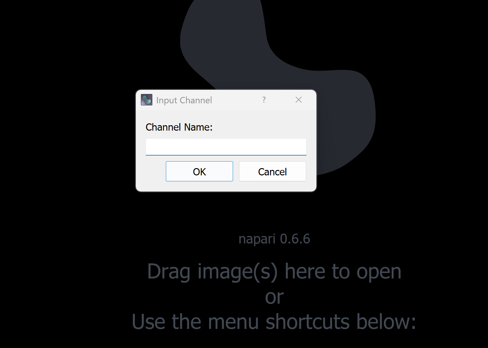
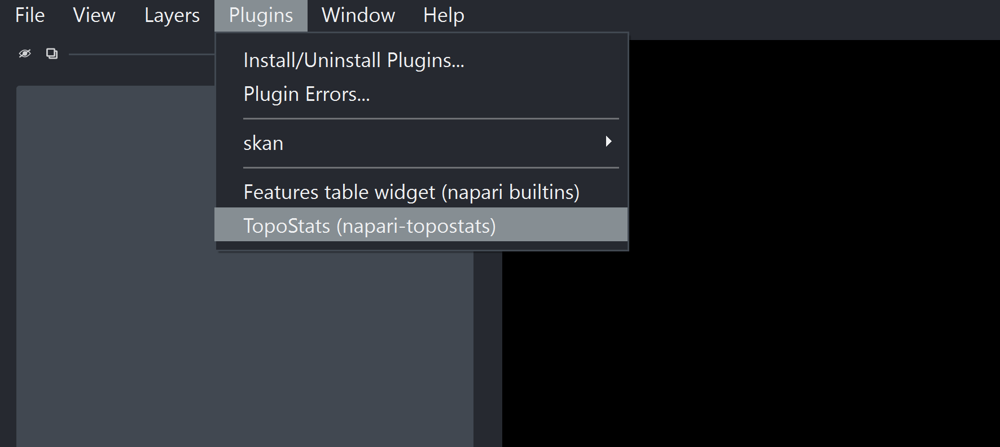
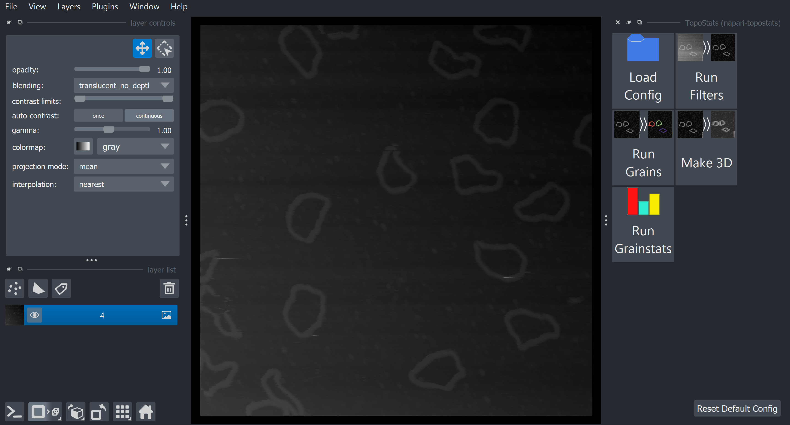
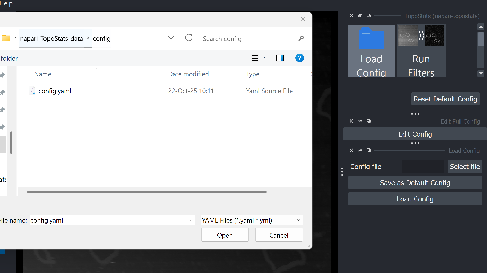
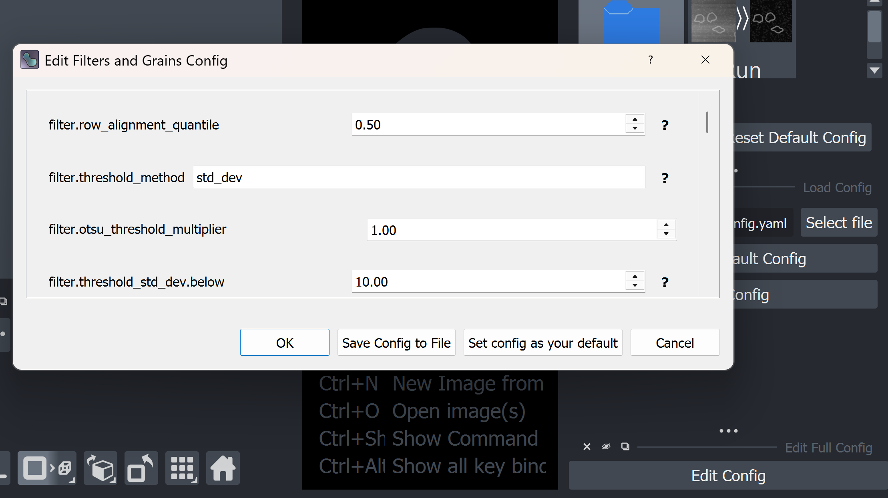
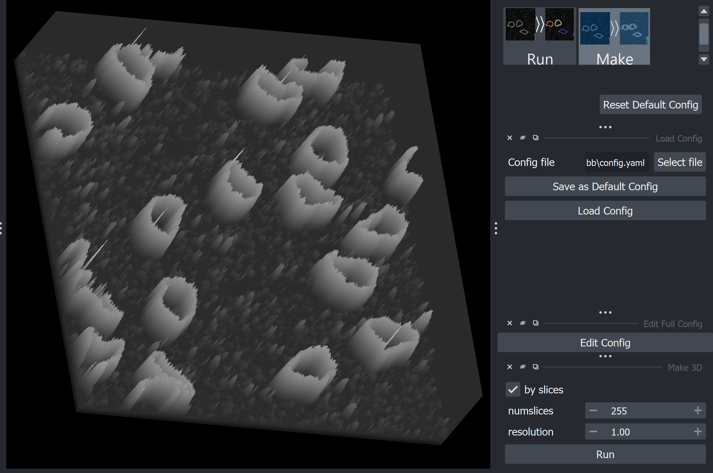

# napari-TopoStats

----------------------------------

This [napari] plugin was generated with [Cookiecutter] using the [cookiecutter-napari-plugin] template.

<!--
Don't miss the full getting started guide to set up your new package:
https://github.com/napari/cookiecutter-napari-plugin#getting-started

and review the napari docs for plugin developers:
https://napari.org/stable/plugins/index.html
-->

## Installation

Activate your Python environment (e.g. Conda) and make sure your Python version is >= 3.10 and < 3.12. An example
conda enviroment command would be:

    conda create -n napari-env python=3.11
    conda activate napari-env

With [Git installed] on your machine, install the napari-TopoStats package from GitHub using [pip][pip].

    pip install git+https://github.com/AFM-SPM/napari-TopoStats.git@main

This command will install other required modules from GitHub (AFMReader, napari-AFMReader, TopoStats)

You can then run napari with:

    napari

## Usage

To load an image into the napari viewer, drag and drop your image file into the window.
A small window will open prompting you to input the input channel for the image you are loading.
Enter the channel used by your image (e.g. Height). The loaded image will appear as a layer in the GUI.

Topostats tools can be accessed from the toolbar of napari (top left) as shown.

This will then open a window containing buttons with available functions.
Select a layer, then click the button corresponding to the function you want to run on the layer.

Before running the function, you can choose to load a config file using the button and selecting the file.
Both json and yaml file formats are supported.
This config will be used for the functions you run until you close napari.
There is also a button to save that file as the new default (instead of the topostats generated one). This default can
be reset to the topostats default at anytime by clicking the Reset
Default Config button in the bottom right of the main window.

If you don't load a config file manually, a default config file ("_generated_config.yaml") is created (in your user config directory for napari topostats) when you run a function which will then be used for all subsequent functions.
Once a config is loaded, either manually or automatically, an edit config window will appear, allowing the config file
to be edited directly through the napari gui. Changes made are not automatically saved to the loaded config file,
however, the updated config file can be saved as a file with the Save to file button at the bottom of the window.
In this window, there is also a button to save the editted config file as the new default.

When you run a function for the first time, a window will open with options to adjust for that function
(which are applied next time the function is run) if that function has options which can be adjusted.
There is also a run button in that window. This runs the function on the selected layer (it does exactly the
same thing as clicking the function button in the grid). Note this window will only appear if there are options which can be adjusted outside of those in the config file.

Current functions:

1. Load config button allows a config file to be selected from your hard disk.
2. Run filters requires an image layer to be selected and creates an image layer with topostats filters run.
3. Run grains requires an image layer to be selected and creates a labels layer with topostats grains detection run.
4. Make 3D requires an image layer to be selected and creates a 3D image layer. Viewing mode (in the bottom left of
the viewer) is automatically switched to 3D.
5. Run Grainstats requires a labels layer **created by the Run Grains function** to be selected and creates an
interactivate table in the dock on the right.

## Contributing

Contributions are very welcome. Tests can be run with [tox], please ensure
the coverage at least stays the same before you submit a pull request.

## License

Distributed under the terms of the [MIT] license,
"napari-loadafm" is free and open source software

## Issues

If you encounter any problems, please [file an issue] along with a detailed description.

[Cookiecutter]: https://github.com/audreyr/cookiecutter
[Git installed]: https://git-scm.com/book/en/v2/Getting-Started-Installing-Git
[MIT]: http://opensource.org/licenses/MIT
[cookiecutter-napari-plugin]: https://github.com/napari/cookiecutter-napari-plugin
[napari]: https://github.com/napari/napari
[pip]: <https://pypi.org/project/pip/>
[tox]: https://tox.readthedocs.io/en/latest/
