To load an image into the napari viewer, drag and drop your afm data file into the window.
A small window will open prompting you to input the input channel for the image you are loading.
Select the channel used by your image (e.g. Height). The loaded image will appear as a layer in the GUI.
Note: this loading utility comes from [napari-AFMReader].

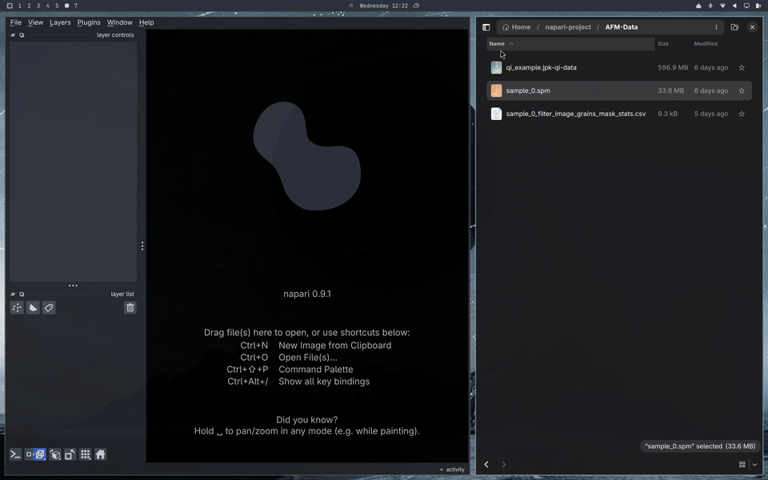

The channel can be changed later after the image has been loaded.

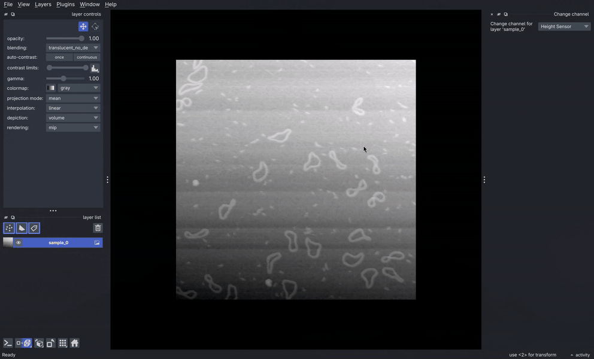

Contrast limits, colour scale and other image options are adjustable in the left pannel.

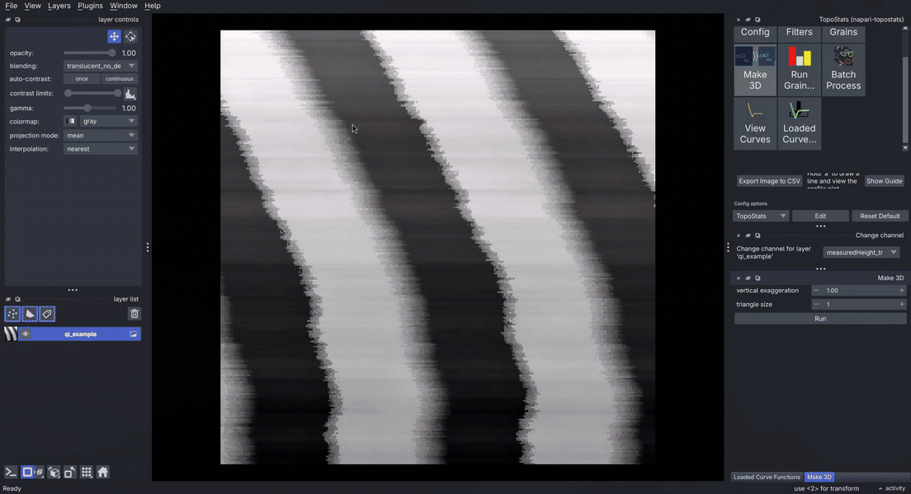

Topostats tools can be accessed from the toolbar of napari (top left) as shown.

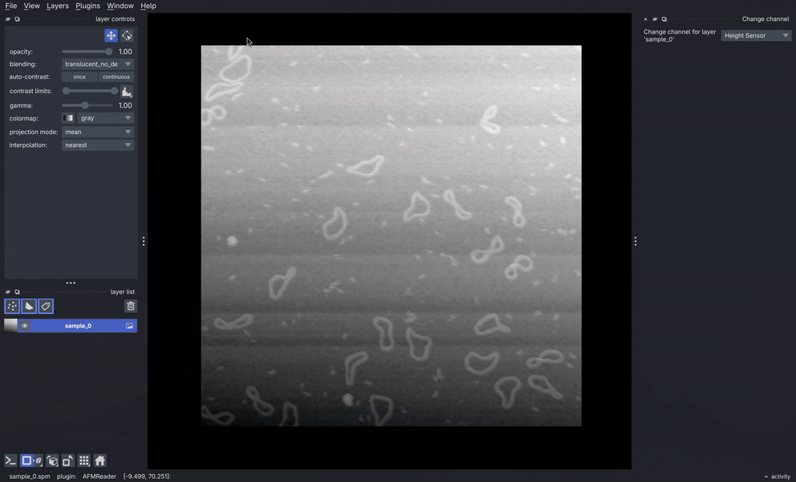

This will then open a window containing buttons with available functions.
Select a layer, then click the button corresponding to the function you want to run on the layer.
For example, you can run topostats filters using your currently loaded config on the selected layer as shown
below and it will create a new image layer in the viewer with the filtered image result.

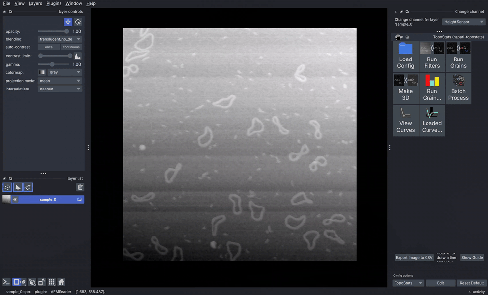

You can find the grains in the selected image using topostats grain finding. This will create a new labels layer
with the detected grains that will overlay over your image.

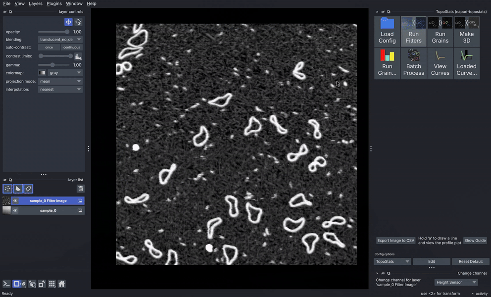

Before running the function, you can choose to load a config file using the button and selecting the file.
Both json and yaml file formats are supported.
This config will be used for the functions you run until you close napari.
There is also a button to save that file as the new default (instead of the topostats generated one). This default can
be reset to the default (defined by topostats or whatever module the config is for) at anytime by clicking the Reset Default Config button in the bottom right
of the main window.

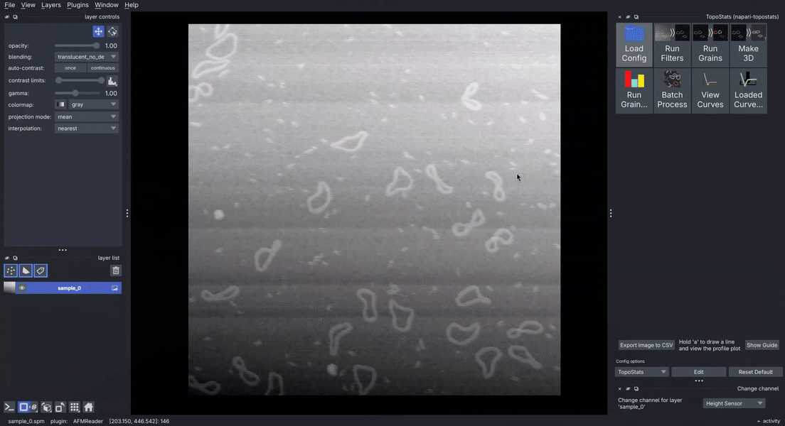

When you run a function which requires the config, if you haven't loaded a config file manually, a default
configuration is used which will be the config you have set as default if you have set one. If you haven't, the
topostats default will be used.
You can edit the currently loaded config using the edit config button at the bottom of the main button grid. This will open an options window on top of the button grid (note they become tabs you can select between at the bottom of the widget). Changes made are not automatically saved
to the loaded config file but will be used in this instance of napari for future functions using that config once you click 'Apply'. The updated config file can be saved as a file with the Save to file button at the bottom of the window. In this window, there is also a button to save the edited config file as the new default that will be used in future versions of napari.

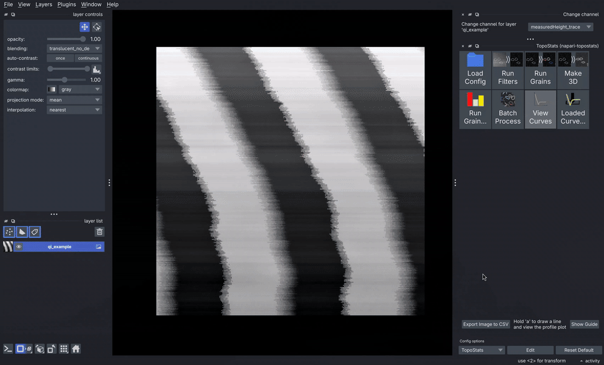

When you run a function for the first time, a window will open with options to adjust for that function
(which are applied next time the function is run) if that function has options which can be adjusted.
There is also a run button in that window. This runs the function on the selected layer (it does exactly the
same thing as clicking the function button in the grid). Note this window will only appear if there are options which
can be adjusted outside of those in the config file. Multiple functions will also group together and become different 'tabs' which are selectable at the bottom. The **Make 3D** function described and shown below is an example of this.

**Make 3D** is a function that allows you to select a layer and create a 3D representation of it, a 'Surface' layer. You can adjust triangle size to reduce the resolution of the surface, note this must be an integer and 1 or greater. You can also apply vertical exaggeration to artificially increase or reduce the height for better viewing. A new surface layer will be created and the viewer will automatically switch to 3D mode. 

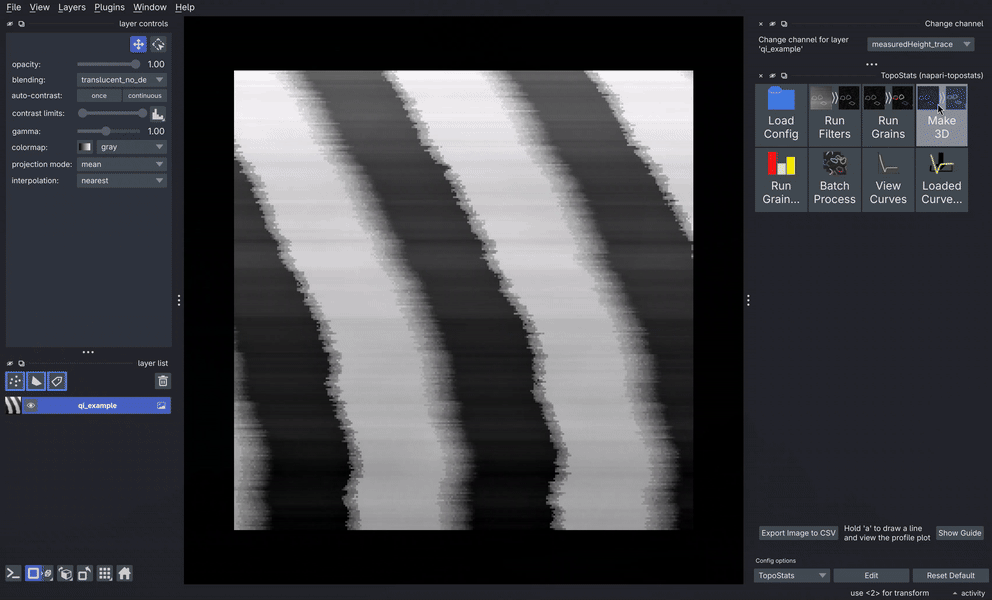

**Note**, if the camera goes weird, like the axis of movement is suddenly very wide, this is likely because you have another surface layer that can be viewed in 3D and napari is trying to frame so you can see both. If this is not desired, deleting the surface layer you don't want to view then clicking the home button in the bottom left corner should fix the issue. You can also switch between 3D and 2D mode using the selector button also in the bottom left. 

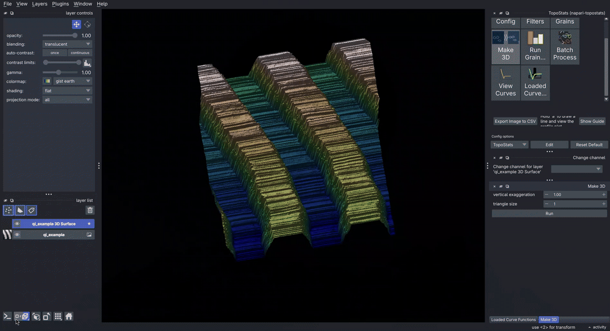

**Run grainstats** allows you to view the topostats generated grainstats for the selected labels layers containing grains identified by the find grains function. It creates a table which can be clicked to correlate the grain in the labels layer to the table, or vice versa by selecting a grain in the image. The table can also be exported and the values can be converted from metres to nanometres (it should be noted that the actual unit is not recorded so this is guessed from the magnitude of the values).

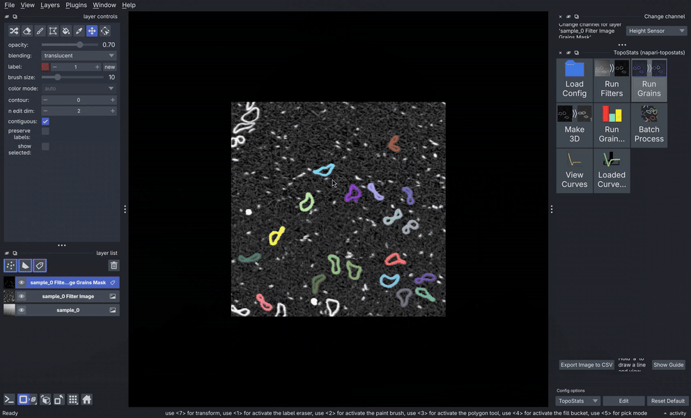

**Batch Process** is a special function that works the same as if running `topostats process` in the command line,
using the config you currently have loaded or the default config (with adjusted options if you have updated your
default) if you haven't loaded a config. If the default is used, a window will appear asking you to select a directory
which contains the data to be processed as well as a directory to save the output files to (which you may want to
create with the new folder button if the directory doesn't exist). Otherwise, the directories defined in the config
file will be used. Once these have been defined topostats will process in the background (the output and progress
can been seen in the command line). You can carry on using napari while this happens.

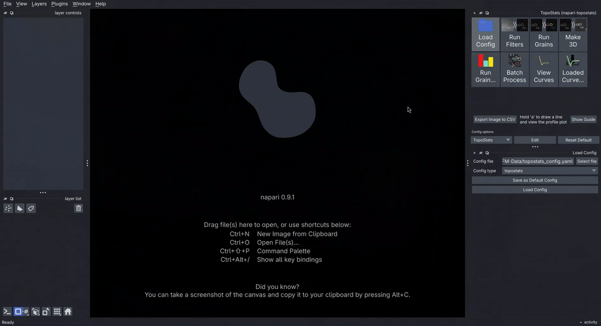

**Viewing Curves** is a function which allows the viewing of the force-distance curves for a point on loaded AFM
data. Once the viewing curves widget has been opened by clicking on its button in the button grid, an individual
force curve can be viewed by holding shift and clicking on the point in the image. Clicking and dragging with the
mouse while holding shift updates the viewer to wherever your mouse is. 

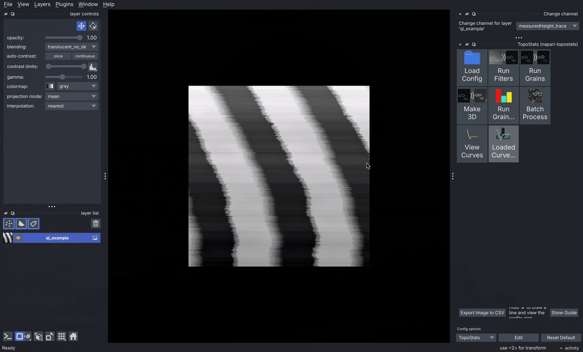

Once a curve is selected, you can change the channel of each axis by selecting the dropdown menu below the graph and selecting the desired channel. You can select the segments you want to be displayed in the dropdown menu. You can also change the volume of your data if it has the file contains multiple volumes such as Trace and Retrace or if you have processed versions of the raw volumes stored in the same file. To view the metadata, click the **Experimental Parameters** button, which will open a window containing that information.

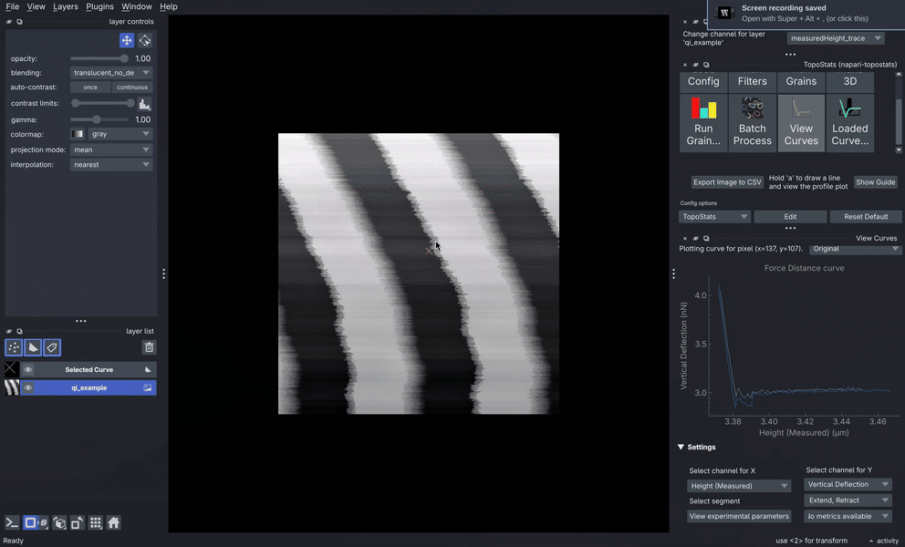

**Viewing profile line**
Pressing and holding the 'A' key
activates the drawing line tool, note that a temporary "Profile Line" shapes line is created. A viewing window will
open in the dock on the right, which will be updated with profile data as you draw a move the line. The channels
being viewed can be changed by using the dropdown menu below the graph and selecting the desired channels. Images
created by applying some function to the image will appear as channels in addition to the defaults. The left and right
axis are independent to allow you to show up to 2 different units (notably this can include more than 2 channels; if multiple channels have the same unit they will be presented on the same axis and scale). 
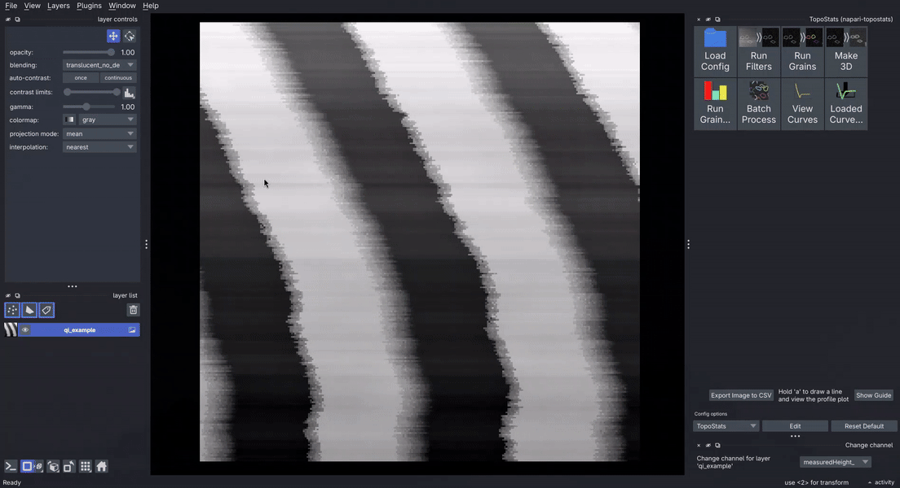

The scale should automatically adjust to give a clear view of all the data, however the left axis can be adjusted by scrolling on that axis or anywhere on the graph and the right axis can be adjusted by specifically scrolling the right axis. The view can be reset and set back to automatic scaling with the reset view button. This is likely to be necessary after manual scaling then changing the channel.
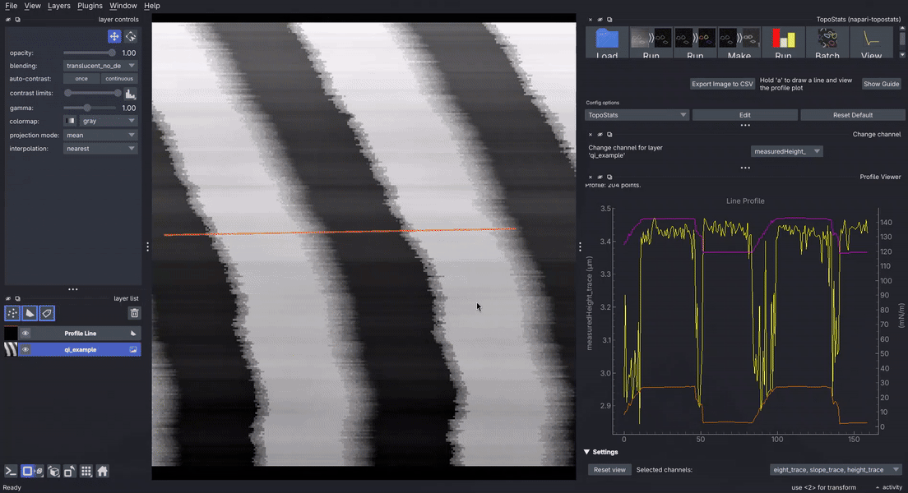

**Loading custom analysis scripts**
Dragging and dropping a python file into the napari viewer allows you to load custom analysis code. A function
which follows the following requirements should work in the GUI.

1. Must take an image (be that from an image layer or a binary image from a labels layer) or force curve data,
which could be an individual force curve (which will mean the code runs on the every curve and creates a map,
therefore requiring the function to output a single value) or the entire set.
2. Any image or force curve parameter must be named exactly `image` or `curves` or `curve`.
3. Parameters must be labled with their type using typing annotations.
4. There must be no parameters of any type other than integer, string, float, boolean or the napari viewer object.
5. The function must not start with an underscore as that is assumed to be a private function.
6. The module the function is part of must only import packages which are installed in the current environment and
cannot import modules from the same project unless those modules have also been installed in the current environment

## Contributing

Contributions are very welcome. Tests can be run with [tox], please ensure
the coverage at least stays the same before you submit a pull request.

## License

Distributed under the terms of the [MIT] license,
"napari-topostats" is free and open source software

## Issues

If you encounter any problems, please [file an issue] along with a detailed description.

[napari-AFMReader]: https://github.com/AFM-SPM/napari-AFMReader
[MIT]: http://opensource.org/licenses/MIT
[tox]: https://tox.readthedocs.io/en/latest/
[file an issue]: https://github.com/AFM-SPM/napari-TopoStats/issues
